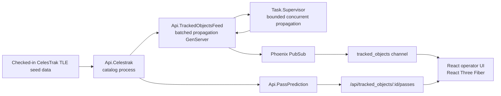

# Tessella

Tessella is a small ground-control-style web application for tracking public orbital catalog objects in real time. It combines an Elixir/Phoenix backend, Phoenix Channels, SGP4 propagation through Orbis, and a React/TypeScript operator interface built on React Three Fiber.

The current version is intentionally narrow: it renders the active CelesTrak catalog as a live common operating picture, lets the operator focus a tracked object, shows basic propagated state, and predicts visibility windows from a ground station.

## Why I Built It

I wanted the first useful artifact to build around one core question:

Can I take public catalog data, propagate it server-side, stream it over a realtime backend, and render it in a browser in a way that's performant and responsive?

That question forced an architectural correction: the most elegant OTP model was not the best model for the full active catalog. I started with a process-per-object design because it matched the mental model of "each spacecraft owns its state." Then I moved to a batched propagation feed when the app became an active-catalog renderer rather than a station-only simulator. I still think the process-per-object model could be useful for enriching tracked objects with more data, but it doesn't make sense for the full catalog.

## Current Capabilities

- Loads checked-in CelesTrak TLE seed data for active, stations, and Starlink catalogs.
- Parses active-catalog TLE records once at backend startup.
- Propagates catalog objects in Elixir using Orbis.
- Streams compact position frames to the frontend over Phoenix Channels.
- Renders the catalog as grouped point layers on a textured 3D Earth.
- Highlights stations, Starlink, or other active objects without rebuilding per-object meshes.
- Lets the operator search the active catalog with a virtualized grouped selector.
- Tracks a selected object with interpolated motion and a focused camera.
- Shows latitude, longitude, altitude, and velocity for the selected object.
- Uses browser geolocation when available, with Centennial, Colorado as the fallback station.
- Predicts upcoming visibility windows for the selected object and station.
- Uses a UTC-derived Sun direction for live scene lighting.

## Architecture



The backend owns the propagated state. The frontend receives frames, interpolates between backend updates, and renders the scene efficiently through a small number of `Points` layers.

The main websocket frame is intentionally compact:

```ts
type PositionTuple = [
  catId: number,
  latitude: number,
  longitude: number,
  altitudeKm: number,
  velocityKmS: number,
];
```

## Development History

### 1. Prove the visual frame

The first frontend version rendered a single selected object against Earth. I originally expected to use Cesium, but switched to Three.js and React Three Fiber because I wanted tighter control over visual style, point rendering, lighting, and scene composition.

### 2. Move propagation to the backend

The backend began with CelesTrak JSON and TLE loaded together, joined by object identity. I then moved SGP4 propagation into Elixir through Orbis so the server would own simulated realtime state instead of asking the browser to become the source of truth.

That gave the app strong domain boundaries:

- catalog data enters the backend
- propagation happens in supervised server code
- Phoenix Channels stream state to clients
- the UI renders state rather than inventing it

### 3. Try the actor-per-object model

The first OTP design modeled each tracked object as its own `GenServer`, registered by catalog ID, with per-object PubSub broadcasts.

I still like that model for a small numbers of tracked objects. It maps nicely to the mental model of "each object owns its state."

### 4. Replace per-object ticking with batched propagation

Once the app moved toward rendering the active catalog, the per-object tick path became the wrong tradeoff. Thousands of independent processes broadcasting individual updates made less sense than one aggregate feed producing catalog frames.

The current backend uses `Api.TrackedObjectsFeed` as the source of propagated runtime state. It parses TLE records once at initialization, runs propagation in a supervised background task, bounds concurrency with `Task.async_stream/3`, and broadcasts compact aggregate frames.

That decision changed the architecture in a useful way:

- passive catalog objects are propagated in batches
- websocket clients subscribe to one aggregate stream
- socket joins and state reads do not block on propagation work
- the payload shape is optimized for repeated rendering
- per-object process supervision remains available as a future model for commandable spacecraft

### 5. Make the frontend scale with the catalog

The frontend went through the same growing pains. It started with individual object rendering, then moved to batched `Points` layers split into Stations, Starlink, and Other groups.

The native object selector also became a bottleneck risk, so I replaced it with a virtualized grouped combobox backed by `@tanstack/react-virtual`.

### 6. Add operator context

After the catalog renderer was working, I added ground-station context and visibility windows. The UI now treats the selected object and station as the two inputs, then shows live state and predicted contact opportunities as the outputs.

## Running Locally

Backend:

```bash
cd api
mix setup
mix phx.server
```

Frontend:

```bash
cd web
npm ci
npm run dev
```

The Vite dev server proxies `/api` and `/socket` to Phoenix on `localhost:4000`.

Production-style build:

```bash
./build.sh
```

Validation:

```bash
cd api
mix format --check-formatted
mix compile --warnings-as-errors
mix test

cd ../web
npm run lint
npm run build
```

## Refreshing Catalog Data

The repo includes checked-in seed data so the app can run without depending on network availability at startup. To refresh those files:

```bash
cd api
./scripts/refresh-data.sh
```

The script fetches CelesTrak `active`, `stations`, and `starlink` data in both JSON and TLE formats. The current backend uses `active.tle` as the source of truth for propagated catalog state.
